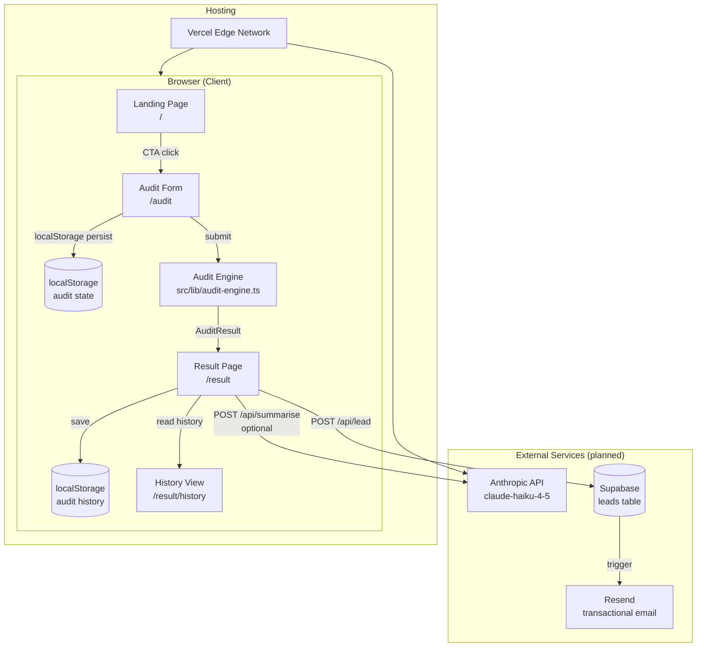

# StackAudit — Architecture

> **Status:** MVP · Next.js 16 App Router · Fully client-side audit engine (no backend required at this scale)

---

## 1. System Diagram



> **ASCII fallback** (for environments that don't render Mermaid):
>
> ```
> Browser
>   Landing (/)
>     └─▶ Audit Form (/audit)
>           ├─▶ localStorage  [form persistence]
>           └─▶ audit-engine.ts  [pure function, no network]
>                 └─▶ AuditResult object
>                       └─▶ Result Page (/result)
>                             ├─▶ localStorage  [history]
>                             ├─▶ /api/summarise  → Anthropic API  [planned]
>                             └─▶ /api/lead       → Supabase + Resend  [planned]
> ```

---

## 2. Data Flow: Input → Audit Result

### Step 1 — Form State (`AuditFormState`)

The user fills in the Audit Form (`/audit`). Each tool card captures:

| Field | Type | Notes |
|---|---|---|
| `toolId` | `ToolId` | One of 8 known tools |
| `enabled` | `boolean` | Toggle on/off |
| `plan` | `string` | e.g. `"pro"`, `"business"` |
| `monthlySpend` | `string` | USD, user-entered |
| `seats` | `string` | Number of licences |
| `useCase` | `string` | `coding`, `writing`, `data`, etc. |

The `useAuditForm` hook writes the entire `AuditFormState` to `localStorage` on every change, so a page refresh never loses progress.

### Step 2 — Audit Engine (`src/lib/audit-engine.ts`)

`runAudit(form: AuditFormState): AuditResult` is a **pure, synchronous function** — no network, no side effects.

Current rules (placeholder):
1. Compare each tool's `seats` against `form.teamSize`.
2. If `seats > teamSize`, flag as over-provisioned and estimate a ~20% saving.
3. Sum per-tool savings into `totalMonthlySaving` and `totalAnnualSaving`.
4. Generate a templated `aiSummary` string (threshold: $500/month).

The `AuditResult` object carries:

```
AuditResult {
  id                  — crypto.randomUUID() slug
  formState           — echo of user input
  recommendations[]   — per-tool action + saving
  totalMonthlySpend
  totalMonthlySaving
  totalAnnualSaving
  aiSummary           — templated string (→ Anthropic when wired)
  auditedAt           — ISO timestamp
}
```

### Step 3 — Result Page & History

- `AuditResult` is stored in `localStorage` under `audit-history` (via `src/lib/audit-history.ts`).
- The Result Page reads the latest result from state; the History view lists all past audits.
- **No server round-trip** is required for the core audit experience.

### Step 4 — Planned server interactions (not yet live)

| Endpoint | Trigger | Effect |
|---|---|---|
| `POST /api/summarise` | Result page mount | Calls Anthropic claude-haiku-4-5, returns `aiSummary` |
| `POST /api/lead` | Email capture submit | Writes row to Supabase `leads` table, triggers Resend welcome email |

---

## 3. Why This Stack?

| Choice | Rationale |
|---|---|
| **Next.js 16 (App Router)** | Zero-config Vercel deploy, React Server Components available for future API routes, file-based routing keeps the entry point thin. Route files are deliberately kept as thin wrappers — all logic lives in `features/` and is portable if routing changes. |
| **React 19** | Stable concurrent features; pairs cleanly with Next.js 16's server/client boundary. |
| **TypeScript 5** | Catches shape mismatches between `AuditFormState` → `AuditResult` at compile time, not at runtime in front of a user. |
| **Tailwind CSS v4 (CSS-first)** | No `tailwind.config.js` — all design tokens live in `globals.css`. Removes a layer of indirection for contributors. |
| **localStorage (no DB at MVP)** | The form must survive refreshes without login. A server-side draft system would add auth complexity with no user benefit at this stage. |
| **Deterministic audit engine** | The audit math is hardcoded rules, not AI. Knowing *when not* to use AI is part of the product's credibility. AI is only used for the optional ~100-word prose summary. |
| **Anthropic claude-haiku-4-5 (planned)** | Fastest and cheapest Claude model; the summary prompt is short (~50 tokens in, ~100 tokens out), so latency and cost are negligible at MVP scale. |
| **Vercel** | First-class Next.js support, edge caching, automatic preview deploys per branch, no infrastructure to manage. |

---

## 4. What Would Change at 10,000 Audits / Day?

At ~10k audits/day (~7 req/s average, bursting higher), the current architecture hits a few walls. Here's what would need to change and why:

### 4.1 Move the audit engine to a server route

**Current:** `runAudit()` runs in the browser — fine for correctness, but pricing rules are visible in the client bundle.  
**At scale:** Move to `POST /api/audit` (Next.js Route Handler or a separate microservice). Benefits:
- Pricing rules and source-of-truth data stay server-side (not downloadable by competitors).
- Enables server-side validation, rate limiting, and logging without touching the client.
- Allows heavier computation (e.g. vector similarity for tool overlap detection) without bloating the JS bundle.

### 4.2 Replace localStorage history with a real database

**Current:** `localStorage` — zero infra, zero cost, zero sharing.  
**At scale:** Postgres via Supabase (already planned for lead capture). Each `AuditResult` gets its `id` as the primary key. Benefits:
- Shareable result URLs that survive browser clears.
- Aggregate analytics (which tools are most over-provisioned, average saving per vertical).
- Cross-device access if a login layer is added.

### 4.3 Cache Anthropic responses

**Current:** Every audit will call the Anthropic API — at 10k/day that's ~$10–$50/day in API costs for the summary alone.  
**At scale:**
- Hash the `AuditFormState` input and store `(hash → aiSummary)` in Redis/Upstash with a 24h TTL.
- ~80% of inputs are similar enough that cache hit rates will be high (most users pick the same 3–4 tools in similar configurations).

### 4.4 Rate limiting and abuse prevention

- Add Upstash Redis rate limiting on the `/api/audit` and `/api/lead` routes (e.g. 10 audits/IP/hour).
- Add hCaptcha or Cloudflare Turnstile to the lead capture form.

### 4.5 Observability

- Structured logging (Axiom or Datadog) on every `/api/audit` call: tool mix, team size, total spend bucket, latency, error rate.
- Track `totalMonthlySaving` distribution — this is the core product metric.
- Alert on Anthropic API error rate > 1% (triggers fallback template, but signals a quota issue).

### 4.6 Deployment topology

```
User → Vercel Edge (CDN + static assets)
           │
           └─▶ Next.js Route Handlers (serverless functions)
                     │
                     ├─▶ Supabase Postgres  (audit results + leads)
                     ├─▶ Upstash Redis      (rate limiting + AI cache)
                     └─▶ Anthropic API      (ai summary, cached)
```

At 10k/day, Vercel's serverless functions handle the load comfortably (they auto-scale). The only fixed infrastructure cost is the Supabase instance (~$25/month for the free tier's successor) and Upstash Redis (~$0.2/10k commands). Total infra cost at this scale: **< $100/month**.

---

